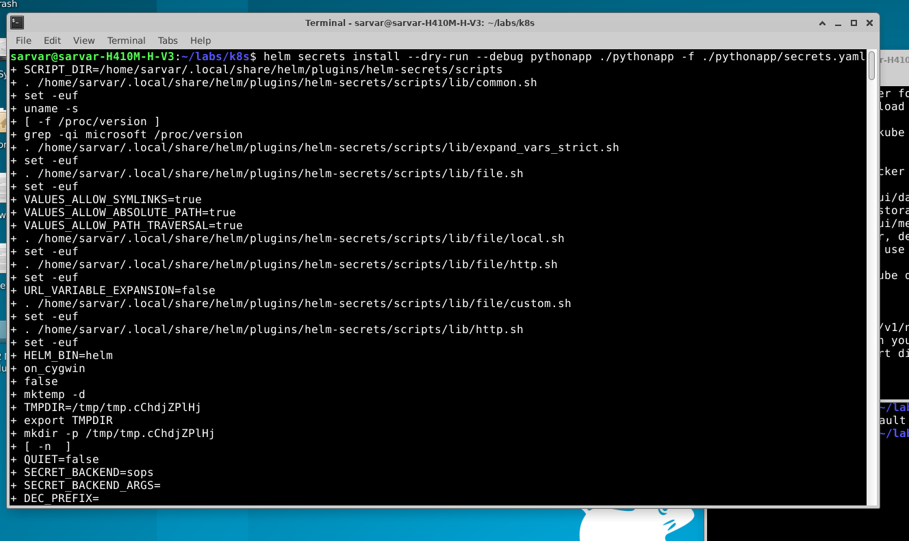
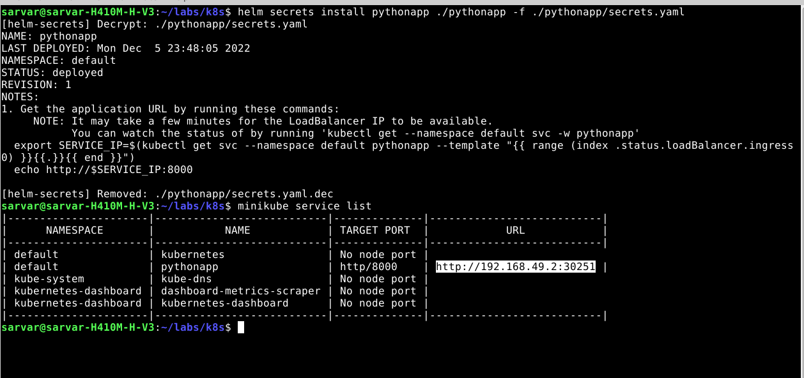
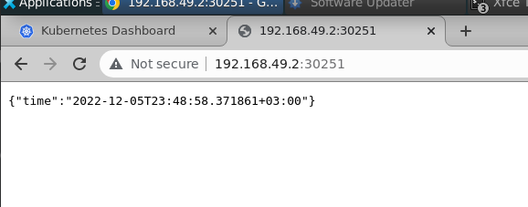
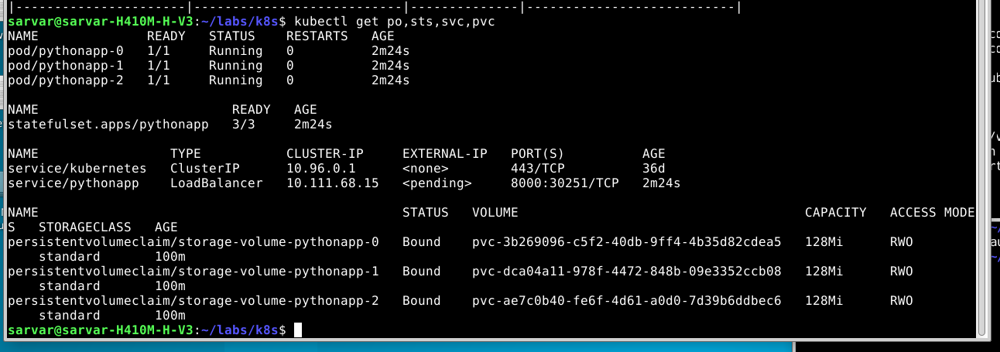
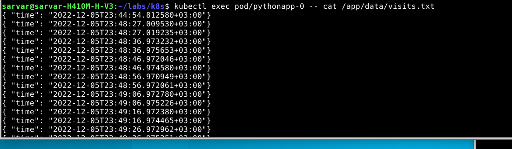
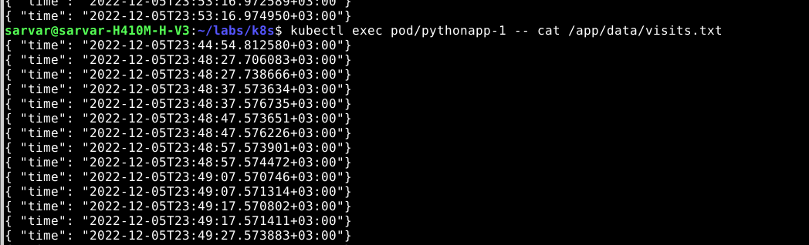
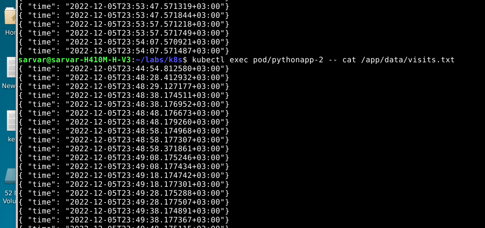

1. Output of `helm install --dry-run --debug name_of_your_chart path_to_your_chart`

2. Deploying chart

3. Output of `kubectl get po,sts,svc,pvc`

4. Checking the content

5. Differences between the output of the command for replicas

As we have StatefulSets, we have three independent pods with own storages. 
Load balancer routes the request to one of the pods, thus making a record in `visits.txt`
file of only that pod.

6. For our app ordering guarantee are unnecessary. Describe in the report why. Then find a way to tell to the StatefulSet controller to launch or terminate all Pods in parallel. Implement it.

Replicas does not depend on each other, so order of receiving request does not matter.
We can make StatefulSet controller manage pods in parallel by adding `podManagementPolicy: "Parallel"` in `statefulset.yaml`