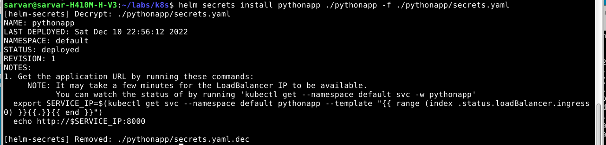

# Lab 14

## Components of the stack

- Prometheus Operator: helps to configure Prometheus with kubernetes 
- Prometheus: tool for monitoring metrics and alerts
- Alertmanager: manager for alerts for apps, for example, Prometheus
- Prometheus node-exporter: tool for monitoring OS and hardware metrics, and send them in Prometheus
- Prometheus Adapter for Kubernetes Metrics APIs: tool for monitoring kubernetes metrics to Prometheus
- kube-state-metrics: tool for monitoring state of k8s objects
- Grafana: visualization tool

## Installing cluster

Install minikube

```commandline
minikube delete && minikube start --kubernetes-version=v1.23.0 --memory=6g --bootstrapper=kubeadm --extra-config=kubelet.authentication-token-webhook=true --extra-config=kubelet.authorization-mode=Webhook --extra-config=scheduler.bind-address=0.0.0.0 --extra-config=controller-manager.bind-address=0.0.0.0
```

Add repo

```commandline
helm repo add prometheus-community https://prometheus-community.github.io/helm-charts
helm repo update
```

Install stack

```commandline
helm install monitoring prometheus-community/kube-prometheus-stack
```


Install my apps



## Output of `kubectl get po,sts,svc,pvc,cm`


