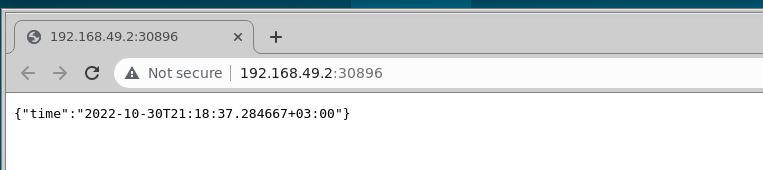
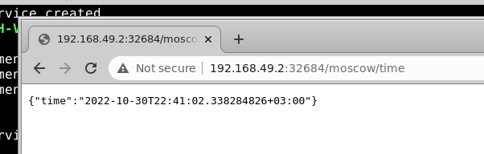

# Lab artifacts

## Output of `kubectl get pods,svc`

```
NAME                             READY   STATUS    RESTARTS   AGE
pod/pythonapp-7b77d96fd5-cj97m   1/1     Running   0          10m

NAME                 TYPE           CLUSTER-IP     EXTERNAL-IP   PORT(S)          AGE
service/kubernetes   ClusterIP      10.96.0.1      <none>        443/TCP          171m
service/pythonapp    LoadBalancer   10.103.187.0   <pending>     8000:30303/TCP   4m45s
```

## Output of `kubectl get pods,svc` from yaml files

```
NAME                                        READY   STATUS    RESTARTS   AGE
pod/pythonapp-deployment-777778d7f4-4tgds   1/1     Running   0          27m
pod/pythonapp-deployment-777778d7f4-k4sxp   1/1     Running   0          27m
pod/pythonapp-deployment-777778d7f4-wqjph   1/1     Running   0          27m

NAME                        TYPE           CLUSTER-IP     EXTERNAL-IP   PORT(S)          AGE
service/kubernetes          ClusterIP      10.96.0.1      <none>        443/TCP          3h28m
service/pythonapp-service   LoadBalancer   10.96.15.170   <pending>     8000:32756/TCP   60s
```

## Output of `minikube service --all`

```
|-----------|------------|-------------|--------------|
| NAMESPACE |    NAME    | TARGET PORT |     URL      |
|-----------|------------|-------------|--------------|
| default   | kubernetes |             | No node port |
|-----------|------------|-------------|--------------|
😿  service default/kubernetes has no node port
|-----------|-------------------|-------------|---------------------------|
| NAMESPACE |       NAME        | TARGET PORT |            URL            |
|-----------|-------------------|-------------|---------------------------|
| default   | pythonapp-service |        8000 | http://192.168.49.2:30896 |
|-----------|-------------------|-------------|---------------------------|
🎉  Opening service default/pythonapp-service in default browser...
```

## Screenshot from browser



## Outputs for extra app

```commandline
NAME                                       READY   STATUS    RESTARTS   AGE
pod/kotlinapp-deployment-c59fd6479-4f22s   1/1     Running   0          65s
pod/kotlinapp-deployment-c59fd6479-t697w   1/1     Running   0          65s
pod/kotlinapp-deployment-c59fd6479-x6q9p   1/1     Running   0          65s

NAME                        TYPE           CLUSTER-IP      EXTERNAL-IP   PORT(S)          AGE
service/kotlinapp-service   LoadBalancer   10.109.212.63   <pending>     8080:32684/TCP   39s
service/kubernetes          ClusterIP      10.96.0.1       <none>        443/TCP          5h12m


|-----------|-------------------|-------------|---------------------------|
| NAMESPACE |       NAME        | TARGET PORT |            URL            |
|-----------|-------------------|-------------|---------------------------|
| default   | kotlinapp-service |        8080 | http://192.168.49.2:32684 |
|-----------|-------------------|-------------|---------------------------|
|-----------|------------|-------------|--------------|
| NAMESPACE |    NAME    | TARGET PORT |     URL      |
|-----------|------------|-------------|--------------|
| default   | kubernetes |             | No node port |
|-----------|------------|-------------|--------------|
  service default/kubernetes has no node port
  Opening service default/kotlinapp-service in default browser...

```



# Ingress

Ingress - this is a concept in kubernetes, which exposes HTTP and HTTPS routes from the
cluster to the external services.

Ingress controller - pod, which implements the routing rules defined by Ingress.

StatefulSet - an API, which can manage and monitor applications. Like a Deployment, but applications
which are managed with it are not interchangeable.

DaemonSet - another manager of the deployments, but in this case it ensures that some pod runs
in the node. For example, if we want all our apps to have some logging app within, we can
make it with DaemonSet.

Persistent Volumes - storage, like a volume, but it is independent of Pod. It gives an opportunity 
to restart pod and share data between them safely.

# Lab 10

# Python app output

```
sarvar@sarvar-H410M-H-V3:~/labs/k8s$ minikube service pythonapp
|-----------|-----------|-------------|---------------------------|
| NAMESPACE |   NAME    | TARGET PORT |            URL            |
|-----------|-----------|-------------|---------------------------|
| default   | pythonapp | http/8000   | http://192.168.49.2:32517 |
|-----------|-----------|-------------|---------------------------|
🎉  Opening service default/pythonapp in default browser...
sarvar@sarvar-H410M-H-V3:~/labs/k8s$ MESA-INTEL: warning: Performance support disabled, consider sysctl dev.i915.perf_stream_paranoid=0

Opening in existing browser session.
^C
sarvar@sarvar-H410M-H-V3:~/labs/k8s$ kubectl get pods,svc
NAME                             READY   STATUS    RESTARTS   AGE
pod/pythonapp-847b77fc6d-crxc4   1/1     Running   0          3m34s
pod/pythonapp-847b77fc6d-dh5bw   1/1     Running   0          3m34s
pod/pythonapp-847b77fc6d-jjzbf   1/1     Running   0          3m34s

NAME                 TYPE           CLUSTER-IP     EXTERNAL-IP   PORT(S)          AGE
service/kubernetes   ClusterIP      10.96.0.1      <none>        443/TCP          7d22h
service/pythonapp    LoadBalancer   10.99.123.88   <pending>     8000:32517/TCP   3m34s
sarvar@sarvar-H410M-H-V3:~/labs/k8s$ 

```

## Extra app output

```
sarvar@sarvar-H410M-H-V3:~/labs/k8s$ minikube service kotlinapp
|-----------|-----------|-------------|---------------------------|
| NAMESPACE |   NAME    | TARGET PORT |            URL            |
|-----------|-----------|-------------|---------------------------|
| default   | kotlinapp | http/8080   | http://192.168.49.2:30656 |
|-----------|-----------|-------------|---------------------------|
🎉  Opening service default/kotlinapp in default browser...
sarvar@sarvar-H410M-H-V3:~/labs/k8s$ MESA-INTEL: warning: Performance support disabled, consider sysctl dev.i915.perf_stream_paranoid=0

Opening in existing browser session.
^C
sarvar@sarvar-H410M-H-V3:~/labs/k8s$ kubectl get pods,svc
NAME                             READY   STATUS    RESTARTS   AGE
pod/kotlinapp-76f486d8c8-4vxqx   1/1     Running   0          103s
pod/kotlinapp-76f486d8c8-8256d   1/1     Running   0          103s
pod/kotlinapp-76f486d8c8-ckdb6   1/1     Running   0          103s

NAME                 TYPE           CLUSTER-IP     EXTERNAL-IP   PORT(S)          AGE
service/kotlinapp    LoadBalancer   10.103.66.67   <pending>     8080:30656/TCP   103s
service/kubernetes   ClusterIP      10.96.0.1      <none>        443/TCP          7d23h
sarvar@sarvar-H410M-H-V3:~/labs/k8s$ 

```
